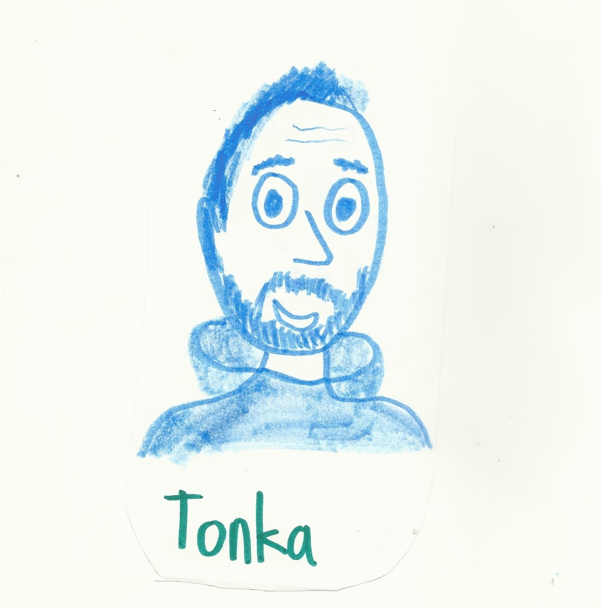

I am no artist. I mean, back in the day, I could draw a pretty *mean-looking* [Garfield](https://www.gocomics.com/garfield). It was decent enough that, back in fourth grade, I was tasked with drawing one that was two feet tall and it stayed up at my school for a couple of years. But that is the extent of *my* artistic career.

Unbeknownst to me, one of my sons (who we nicknamed "Tonka") decided to draw a portrait of me one evening and he gave it to me after we finished our family prayers.

I loved it right away. Was a perfect representation of me? No, but it was close enough for a 12 year old boy **and** it makes me laugh (still) when I look at it. I loved it so much that I used it a few places for my profile picture. And when I started working on this blog, I remembered this drawing and thought that it might give it a nice, *personal* touch, so I had Gemini turn it into a reusable logo. It came up with this.

I think Gemini did a decent job of capturing the personality of the original, but it lost *some* of the charm. Right now, I think it is good enough and I plan to use it more often for other artwork that I might need on this blog.

So, now you know the rest of the story...